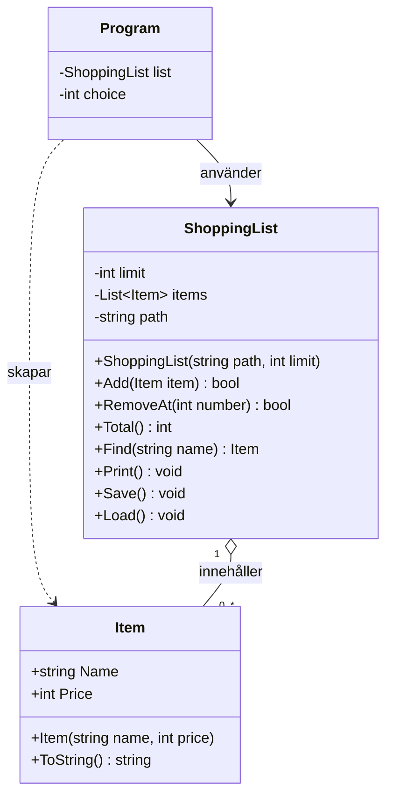

# Robust inköpslista

## Felrapport

Startkoden innehöll sex fel: fyra som får programmet att krascha, ett som ger fel resultat och ett som döljer att något gick fel.

### Fel 1: Programmet kraschar om man skriver bokstäver där det ska vara ett tal
**Vad hände:** Om man skrev bokstäver i menyvalet, i priset eller i numret för att ta bort en vara kraschade programmet med `FormatException`.

**Varför:** `Program.cs` använder `int.Parse` på det användaren skriver (rad 16, 23 och 29). `int.Parse` kastar ett undantag om texten inte är ett tal.

**Hur löst:** Menyvalet använder nu `int.TryParse` i stället för `int.Parse`. `TryParse` kraschar inte, utan returnerar `false` om texten inte är ett tal. En `if` kontrollerar svaret. Om det inte var ett tal visas meddelandet "Du måste skriva en siffra.", och `continue` hoppar tillbaka till början av loopen, så att menyn visas igen. Jag valde `TryParse` med `if` i stället för `try`/`catch` med `FormatException`, eftersom felinmatning är något som förväntas hända ofta.

Priset använder också `int.TryParse` på samma sätt. Om priset inte är ett heltal visas "Priset måste vara ett heltal", och ingen vara läggs till.

Numret för att ta bort en vara använder också `int.TryParse`. Om numret inte är ett heltal visas "Numret måste vara ett heltal.", och ingen vara tas bort.

### Fel 2: Programmet kraschar när man tar bort en vara som inte finns
**Vad hände:** Om man valde "Ta bort vara" och skrev ett nummer som inte fanns i listan, till exempel 4 när listan bara har 3 varor, eller 0, kraschade programmet med `ArgumentOutOfRangeException`.

**Varför:** `RemoveAt` i `ShoppingList` gör om numret till ett index med `number - 1` och skickar det vidare till listans `RemoveAt`. Listan räknar från 0, och med 3 varor är bara index 0, 1 och 2 giltiga. Ingen kontroll gjordes av numret innan det användes.

**Hur löst:** `RemoveAt` kontrollerar nu att numret ligger mellan 1 och antalet varor innan något tas bort. Metoden returnerar `bool` i stället för `void`: `true` om varan togs bort och `false` om numret inte fanns. Då kan `Program.cs` få veta om det gick bra och ge användaren ett meddelande.

I `Program.cs` används svaret i en `if`. Om `RemoveAt` returnerar `false` visas "Det finns ingen vara med det numret.".

### Fel 3: Programmet kraschar om items.txt saknas
**Vad hände:** Om filen `items.txt` inte fanns kraschade programmet direkt vid start med `FileNotFoundException`. Anropsstacken pekade på `ShoppingList.cs` rad 121, som anropades från `list.Load()` på rad 2 i `Program.cs`.

**Varför:** `Load` anropar `File.ReadAllText(path)` utan att först kontrollera att filen finns.

**Hur löst:** Först i `Load` finns nu en kontroll med `File.Exists(path)`. Om filen inte finns avslutas `Load` med `return`, och programmet startar med en tom lista i stället för att krascha. Jag valde `if` i stället för `try`/`catch`, eftersom det går att kontrollera i förväg om filen finns.

### Fel 4: Programmet kraschar vid start och sökningen hittar inte varor
**Vad hände:** När `items.txt` fanns kraschade programmet vid start med `IndexOutOfRangeException`. Dessutom hittade sökningen inte varor som syntes i listan.

**Varför:** `Save` avslutar varje rad med `\r\n`, men `Load` delar bara texten på `'\n'`. Det ger två problem:
- Den sista "raden" blir tom. `Split(';')` ger då bara en del, och `parts[1]` finns inte.
- Ett osynligt `\r` blir kvar i slutet av varje namn, så `"Mjölk"` blir `"Mjölk\r"` och `Find("Mjölk")` hittar ingenting.

**Hur löst:** `File.ReadAllText` och `Split('\n')` är ersatta med `File.ReadAllLines`. Den delar upp filen i rader och klarar både `\r\n` och `\n`, så inget `\r` blir kvar i namnen och ingen tom rad skapas i slutet av filen.

Dessutom kontrolleras varje rad innan den används, så att en trasig rad i filen inte kraschar programmet:
- En `if` kontrollerar att raden har exakt två delar (`parts.Length`) och att priset är ett tal (`int.TryParse` i stället för `int.Parse`). Om inte skrivs ett meddelande ut, och `continue` hoppar till nästa rad.
- `new Item(...)` ligger i en `try`. Om `Item` vägrar värdena (tomt namn eller negativt pris) fångar `catch (ArgumentException)` felet, och användaren får veta att varan hoppades över. `ArgumentOutOfRangeException` fångas också, eftersom den ärver från `ArgumentException`.

Trasiga rader hoppas alltså över, men resten av filen läses in.

### Fel 5: Totalsumman blir fel
**Vad hände:** Totalsumman stämde inte när man räknade efter för hand. Den första varans pris saknades.

**Varför:** Loopen i `Total` börjar på `i = 1`, men listan räknar från 0. Den första varan, på index 0, räknas därför aldrig med.

**Hur löst:** Loopen börjar nu på `i = 0`, så att alla varor kommer med i summan. Villkoret `i < items.Count` var redan rätt och är oförändrat.

### Fel 6: Programmet säger att listan är sparad fast det misslyckades
**Vad hände:** Om sparandet misslyckades, till exempel för att filen var låst, fick användaren inte veta det. Programmet skrev "Listan är sparad." ändå.

**Varför:** `catch`-blocket i `Save` är tomt, och meddelandet skrivs ut efter `try`/`catch`, så det skrivs alltid ut.

**Hur löst:** "Listan är sparad." är flyttat in i `try`, direkt efter `WriteAllText`. Det skrivs därför bara ut när sparandet lyckades. Raden som stod efter `catch` och alltid skrevs ut är borttagen.

Den tomma `catch` är ersatt med två `catch` som fångar specifika undantag:
- `IOException`, till exempel att filen är låst av ett annat program eller att disken är full.
- `UnauthorizedAccessException`, att programmet saknar rättighet att skriva till filen.

Båda skriver ut att listan inte kunde sparas, tillsammans med felmeddelandet (`ex.Message`), så att användaren får veta vad som gick fel.

## Del 2

### Item skyddar sig själv
Konstruktorn i `Item` vägrar nu ogiltiga värden i stället för att skapa ett trasigt objekt:
- Tomt namn, `null` eller bara mellanslag ger `ArgumentException` (kontrolleras med `string.IsNullOrWhiteSpace`).
- Negativt pris ger `ArgumentOutOfRangeException`. Priset 0 är tillåtet.

I `Program.cs` ligger `list.Add(new Item(name, price))` i en `try`. `catch (ArgumentException)` fångar felet, både tomt namn och negativt pris, eftersom `ArgumentOutOfRangeException` ärver från `ArgumentException`. Användaren får meddelandet "Varan kunde inte läggas till" följt av felet från `Item`, och programmet fortsätter köra.

### Budgettak
`ShoppingList` har ett tak för hur mycket hela listan får kosta:
- Fältet `private int limit;` sparar taket. Det sätts i konstruktorn, `ShoppingList(string path, int limit)`.
- `Program.cs` skapar listan med taket 200 kr: `new ShoppingList("items.txt", 200)`.

`Add` returnerar nu `bool` i stället för `void`. Innan varan läggs till kontrolleras `Total() + item.Price > limit`, alltså om listans nuvarande summa plus den nya varans pris blir större än taket. I så fall returnerar `Add` `false`, och varan läggs inte till. Annars läggs varan till och `Add` returnerar `true`. Summan får bli exakt lika med taket, eftersom `>` används och inte `>=`.

Taket kontrolleras bara när användaren lägger till varor. `Load` använder listans egen `items.Add` direkt, så varorna i filen läses alltid in.

**Program.cs:** Anropet `list.Add(new Item(name, price))` ligger i en `if` med `!`, inne i `try`. Om `Add` returnerar `false` får användaren ett meddelande om att budgeten inte räcker, och programmet fortsätter köra. Anropet ligger kvar i `try`, eftersom `new Item(...)` fortfarande kan kasta ett undantag vid tomt namn eller negativt pris. Det fångas av samma `catch (ArgumentException)` som tidigare.

## Designval
Jag valde att låta `Add` returnera `false` när en vara skulle spränga taket, i stället för att kasta ett undantag.

**Varför:** Att listan blir för dyr är inget fel i programmet. Det är något som är väntat och kan hända helt vanligt när man handlar, precis som i bankexemplet där ett uttag returnerar `false` när saldot inte räcker. Undantag passar bättre för sådant som inte borde hända, till exempel att någon försöker skapa en vara med tomt namn eller negativt pris. Därför kastar `Item` undantag, men `Add` returnerar `false`.

**Vad det betyder för Program.cs:** Svaret kontrolleras med en vanlig `if (!list.Add(...))`, på samma sätt som svaret från `RemoveAt`. Det behövs ingen extra `catch`, och det blir tydligt i koden att "varan fick inte plats" och "varan var ogiltig" hanteras på olika sätt: det första med `if` och det andra med `catch`.

## Klassdiagram

**Så läses diagrammet:**
- Varje ruta är en klass. Överst står fälten, under dem konstruktorn och metoderna.
- `-` betyder `private` och `+` betyder `public`. Ordet efter en metod är det den returnerar.
- `Program` är ingen egen klass i koden. `Program.cs` använder top-level statements, men visas som en ruta eftersom det är där menyn finns. `choice` är menyvalet 1–5.
- `Program` skapar en `ShoppingList` och anropar dess metoder från menyn.
- `Program` skapar också nya `Item` när användaren lägger till en vara.
- En `ShoppingList` innehåller noll eller flera `Item` i listan `items`.
